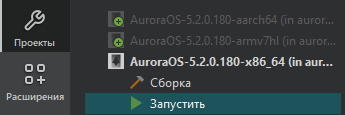
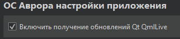
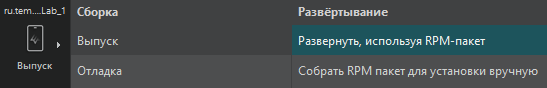
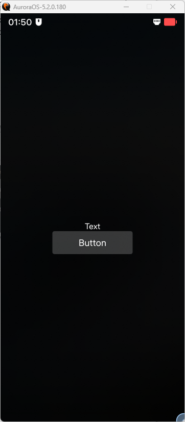
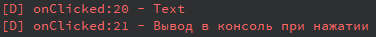
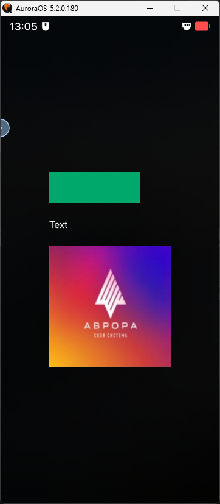
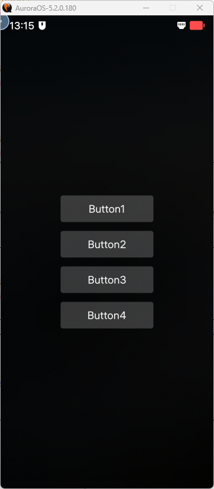
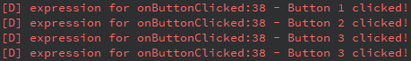

<div align="center">

# Отчёт

</div>

<div align="center">

## Практическая работа №14. Модуль 1

</div>

**Выполнил:** Деревянко Артём Владимирович<br>
**Курс:** 2<br>
**Группа:** ИНС-б-о-24-2<br>
**Направление:** 09.03.02 Информационные системы и технологии<br>
**Проверил:** Потапов Иван Романович

---

### Цель работы
Изучить основы разработки мобильных приложений для ОС «Аврора» в среде Aurora IDE с использованием фреймворка Qt Quick и языка QML: освоить работу с базовыми компонентами интерфейса (TextInput, Button, Rectangle, Image), механизмом якорей (anchors), обработкой сигналов и слотов, анимацией (RotationAnimation, State), а также научиться загружать и отображать внешние данные (XML, JSON) с помощью XmlListModel и XMLHttpRequest.

### Ход работы
#### Задание 1.
**Создать поле ввода текста и кнопку, при нажатии которой будет выводиться текст в консоль.**

1. Была открыта Aurora IDE.
2. Создан новый проект. Проекту дано имя "Lab_1".
3. По пути "Проекты --> Запустить" установлена настройка "Включить получение обновлений Qt QmlLive".<br>
<br>

4. Выполнен переход в MainPage.qml (в папке pages), произведено удаление `PageHeader`, осталось:
```qml
import QtQuick 2.0
import Sailfish.Silica 1.0
Page {
    objectName: "mainPage"
    allowedOrientations: Orientation.All
}
```
5. Для поля ввода текста используется компонент `TextInput`.
```qml
TextInput {
    id: textInput
    anchors.centerIn: parent
    text: "Text"
    color: "white"
}
```
6. Для создания кнопки используется компонент `Button`.
```qml
Button {
    anchors.horizontalCenter: parent.horizontalCenter
    anchors.top: textInput.bottom
    text: "Button"
    onClicked: {
        console.log(textInput.text)
        console.log("Вывод в консоль при нажатии")
    }
}
```
7. "Отладка" была изменена на "Выпуск". Затем был запущен проект. При внесении изменений используем горячие клавиши `ctrl + s` для их сохранения, и изменения сразу отображаются в эмуляторе.<br>

8. Запуск проекта (скриншоты с эмулятора).<br>

9. При нажатии на кнопку, в консоль выводится сообщение:<br>

10. Полный код:
```qml
import QtQuick 2.0
import Sailfish.Silica 1.0
Page {
    objectName: "mainPage"
    allowedOrientations: Orientation.All

    TextInput {
        id: textInput
        anchors.centerIn: parent
        text: "Text"
        color: "white"
    }

    Button {
        anchors.horizontalCenter: parent.horizontalCenter
        anchors.top: textInput.bottom
        text: "Button"
        onClicked: {
            console.log(textInput.text)
            console.log("Вывод в консоль при нажатии")
        }
    }
}
```

#### Задание 2.
**Расположить элементы (прямоугольник, текст и картинка) по центру экрана друг под другом, используя якоря (anchors).**
1. Создан простой проект по шаблону в Aurora IDE.
2. Во вкладке Проекты --> Запуск подключён Qt QmLilve, чтобы проект не нужно было каждый раз пересобирать при внесении изменений.
3. После изменения "Отладка" на "Выпуск" проект был запущен. При внесении изменений используются горячие клавишы `ctr`+`s` для их сохранения. Изменения сразу отображаются в эмуляторе.
4. Было удалено `PageHeader` в `Mainpage.qml`: осталось:
```qml
Page {
    objectName: "mainPage"
    allowedOrientations: Orientation.All
}
```
5. Создан элемент `Column` в котором будут храниться компоненты.
```qml
Column {
    anchors.centerIn: parent
    spacing: 50
}
```
`spacing` - расстояние между компонентами, которые будут в `Column`.
`anchors.centerIn` - parent - расположение по центру родительского элемента (в нашем случае - `Page`).
6. Внутри `Column` созданы компоненты: `Rectangle`, `Text`, `Image`.
```qml
Rectangle {
    id: rect
    width: 300
    height: 100
    color: "#00a86b"
}

Text {
    id: text
    text: qsTr("Text")
    color: "white"
}

Image {
    id: img
    source: "img.jpg"
    width: 400
    height: 400
}
```
7. Запуск проекта.<br>

8. Полный код:
```qml
import QtQuick 2.0
import Sailfish.Silica 1.0

Page {
    objectName: "mainPage"
    allowedOrientations: Orientation.All

    Column {
        anchors.centerIn: parent
        spacing: 50

        Rectangle {
            id: rect
            width: 300
            height: 100
            color: "#00a86b"
        }

        Text {
            id: text
            text: qsTr("Text")
            color: "white"
        }

        Image {
            id: img
            source: "img.jpg"
            width: 400
            height: 400
        }
    }
}
```

#### Задание 3.
**Создать четыре кнопки, к каждой из которых подключен слот, а уже эти слоты передают сигнал в один единый слот с номером нажатой кнопки.**
1. Создан простой проект по шаблону в Aurora IDE.
2. Во вкладке Проекты --> Запуск подключён Qt QmLilve, чтобы проект не нужно было каждый раз пересобирать при внесении изменений.
3. После изменения "Отладка" на "Выпуск" проект был запущен. При внесении изменений используются горячие клавишы `ctr`+`s` для их сохранения. Изменения сразу отображаются в эмуляторе.
4. Было удалено `PageHeader` в `Mainpage.qml`: осталось:
```qml
Page {
    objectName: "mainPage"
    allowedOrientations: Orientation.All
}
```
5. Создан компонент `Column`, в котором будут содержаться кнопки.
```qml
Column {
    id: root
    anchors.centerIn: parent
    spacing: 30
}
```
6. Внутри `Column` создан сигнал: `signal buttonClicked(int buttonNumber)`.
7. Внутри `Column` созданы 4 кнопки и прописан сигнал `buttonClicked`:
```qml
Button {
    text: "Button1"
    onClicked: root.buttonClicked(1)
}

Button {
    text: "Button2"
    onClicked: root.buttonClicked(2)
}

Button {
    text: "Button3"
    onClicked: root.buttonClicked(3)
}

Button {
    text: "Button4"
    onClicked: root.buttonClicked(3)
}
```
8. Использовано `Connections` для соединения:
```qml
Connections {
    target: root
    onButtonClicked: {
        console.log("Button", buttonNumber, "clicked!")
    }
}
```
9. Запуск проекта. При нажатии на кнопки в консоль выводятся сообщения.<br>
<br>

10. Полный код:
```qml
import QtQuick 2.0
import Sailfish.Silica 1.0

Page {
    objectName: "mainPage"
    allowedOrientations: Orientation.All

    Column {
        id: root
        anchors.centerIn: parent
        spacing: 30

        signal buttonClicked(int buttonNumber)

        Button {
            text: "Button1"
            onClicked: root.buttonClicked(1)
        }

        Button {
            text: "Button2"
            onClicked: root.buttonClicked(2)
        }

        Button {
            text: "Button3"
            onClicked: root.buttonClicked(3)
        }

        Button {
            text: "Button4"
            onClicked: root.buttonClicked(3)
        }

        Connections {
            target: root
            onButtonClicked: {
                console.log("Button", buttonNumber, "clicked!")
            }
        }
    }
}
```

### Вывод
В ходе лабораторной работы были изучены основы разработки мобильных приложений для ОС «Аврора» в среде Aurora IDE с использованием фреймворка Qt Quick и языка QML: освоена работа с базовыми компонентами интерфейса (TextInput, Button, Rectangle, Image), механизмом якорей (anchors), обработкой сигналов и слотов, анимацией (RotationAnimation, State), а также получены практические навыки загрузки и отображения внешних данных (XML, JSON) с помощью XmlListModel и XMLHttpRequest. Все задания модуля выполнены, протестированы в эмуляторе и сопровождаются комментариями к программному коду.
